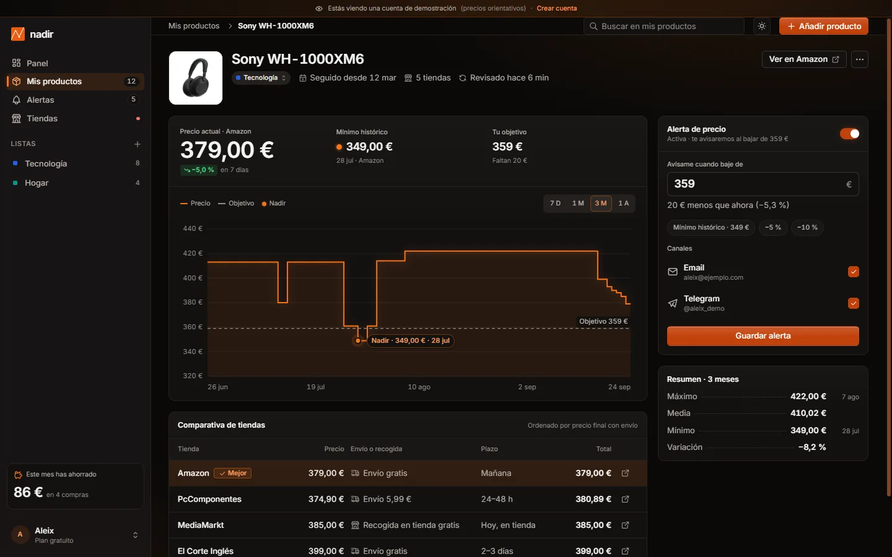
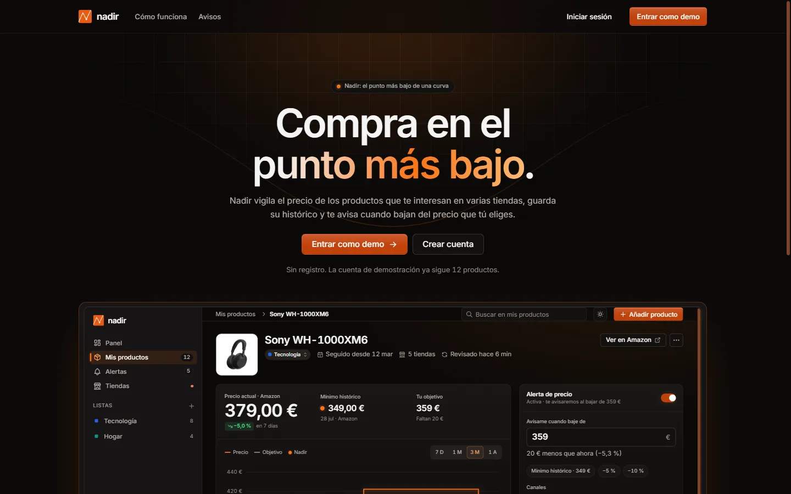
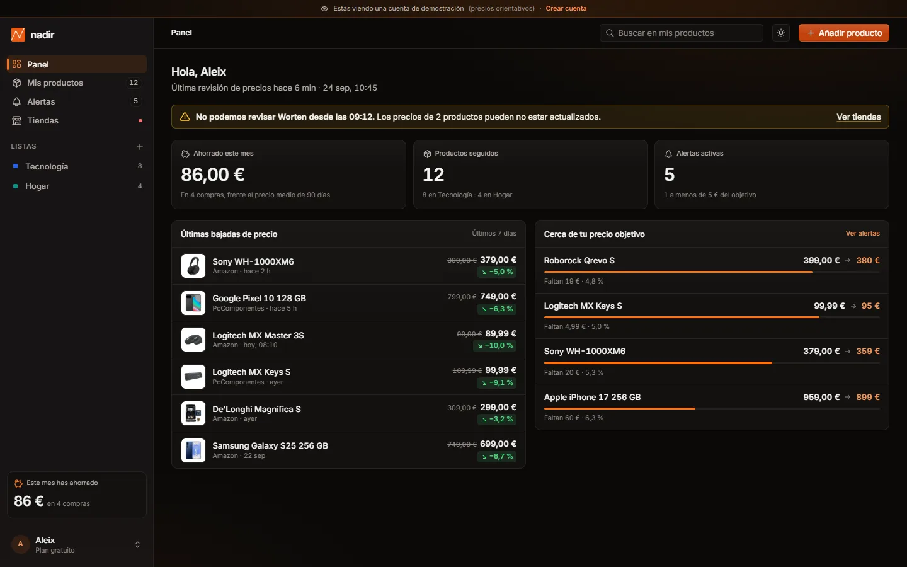
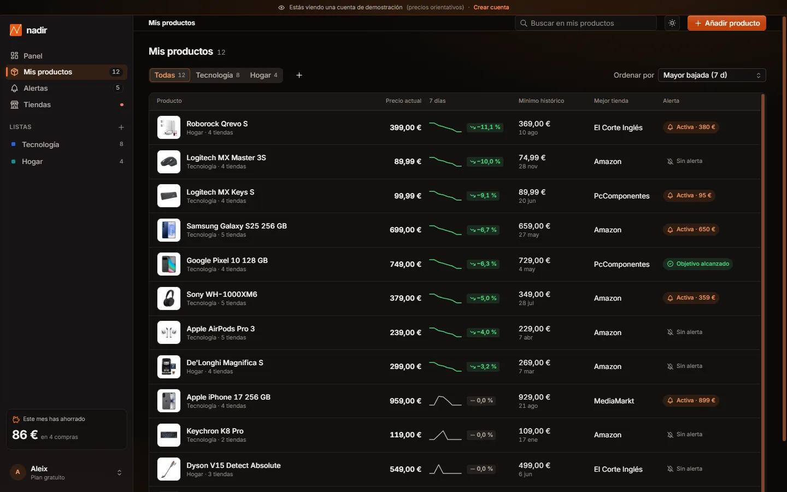
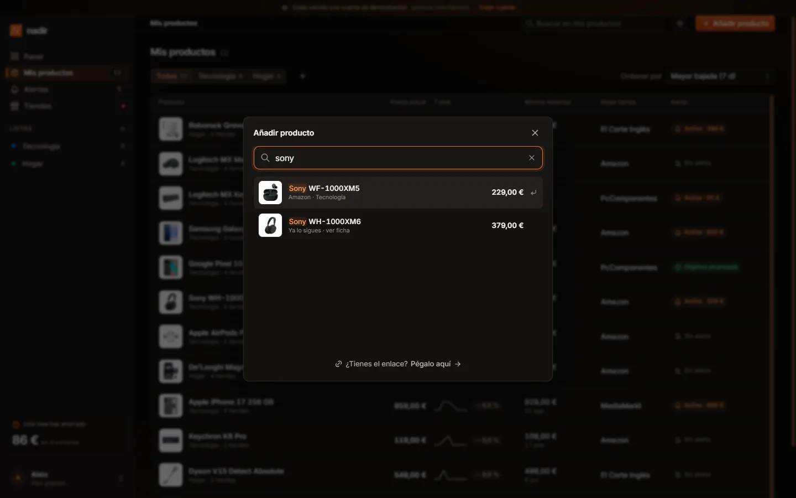

<p align="center">
  
</p>

<h1 align="center">Nadir</h1>

<p align="center">
  <sub>Llegeix aquesta pàgina en:</sub>
</p>
<p align="center">
  <a href="README.md"></a>
  <a href="README.en.md"></a>
  
</p>

<p align="center">
  Compara el preu d'un producte a diverses botigues, en desa l'històric<br>i t'avisa quan baixa del preu que tu tries.
</p>

<p align="center">
  <a href="https://nadir.aleixaj.com/app?demo=1">
    
  </a>
</p>
<p align="center">
  <a href="https://nadir.aleixaj.com/entrar">
    
  </a>
</p>

<p align="center">
  
  
  
  
  
  
  
  
  
  
</p>

## Així es veu

<p align="center">
  
</p>
<p align="center">
  <sub>Fitxa de producte: històric amb el punt més baix marcat, comparativa de botigues i alerta de preu.</sub>
</p>

---

Nadir és un monitor de preus: segueix els productes que t'interessen en diverses botigues, en desa l'historial i t'avisa quan baixen del preu que tu tries.

El nom ve de *nadir*, el punt més baix d'una corba. És un projecte de portfolio construït com un producte SaaS real: disseny propi amb un sistema de tokens, comptes amb Google o correu, base de dades, tasques programades, lògica de domini provada i desplegat en producció.

> **Web:** [nadir.aleixaj.com](https://nadir.aleixaj.com) (la interfície és en castellà)
> **Demo sense registre:** prem «Entrar como demo» i entraràs en un compte que ja segueix 12 productes, amb alertes i un historial d'un any.
> **Compte real:** entra amb Google o crea un compte amb el teu correu, cerca qualsevol producte del catàleg i comença a seguir-ne el preu.

## Què pots fer

- **Tauler** amb les baixades de la setmana, les alertes actives, les últimes baixades i els productes a prop del preu objectiu.
- **Cercar i afegir productes pel nom**, amb suggeriments i fotos mentre escrius i navegació amb el teclat. També es pot enganxar l'enllaç d'una botiga.
- **Els meus productes**: taula amb minigràfica de 7 dies, mínim històric, millor botiga i estat de l'alerta. Filtres per llista, cerca i quatre maneres d'ordenar.
- **Llistes pròpies**: crea, canvia el nom o el color, o esborra les teves llistes i mou cada producte a la que vulguis.
- **Fitxa de producte**, la pantalla principal:
  - gràfica de l'historial dibuixada en SVG, amb períodes de 7 dies, 1 mes, 3 mesos i 1 any, tooltip, línia del preu objectiu i el punt *nadir* marcat;
  - comparativa de botigues ordenada pel preu final, amb l'opció «Millor» destacada;
  - alerta de preu amb interruptor, dreceres (mínim històric, −5 %, −10 %) i canals d'avís;
  - resum del període, «Revisar el preu ara» i «Deixar de seguir».
- **Alertes** actives amb el progrés cap a l'objectiu, i historial d'avisos generats. Quan un preu baixa de l'objectiu, també t'arriba **per correu**.
- **Botigues**: totes les botigues on es venen els teus productes, quants en ven cadascuna, última revisió i reintent si falla.
- **Configuració**: perfil (nom i foto, que pots pujar des del teu ordinador), canvi de contrasenya, canals, freqüència de revisió, tema, tancar la sessió i eliminar el compte amb totes les seves dades.
- **Comptes amb correu**: cal confirmar el correu abans d'entrar, i si oblides la contrasenya t'arriba un enllaç per triar-ne una altra.
- **Instal·lable com a aplicació** (PWA) al mòbil o a l'escriptori.

## Catàleg de prova

Les grans botigues (Amazon, PcComponentes, MediaMarkt…) no permeten llegir les seves pàgines de manera automàtica; en producció les dades arribarien dels seus **programes d'afiliats** (catàlegs oficials amb preus diaris). Per simular-ho de manera honesta:

1. `scripts/seed-catalog.ts` fa **una sola vegada** 63 cerques a Google Shopping Espanya (API de SerpApi) i es queda amb els productes de **botigues conegudes i botigues oficials de marca**, sense accessoris ni preus atípics.
2. Per sumar botigues, cerca cada producte pel seu nom (API de Serper) i només accepta resultats que siguin **exactament el mateix model**: no barreja un iPhone 17 amb un 17 Pro, ni capacitats diferents, ni reacondicionats.
3. Només hi entren botigues **fiables**: cadenes conegudes o botigues ben valorades i amb moltes opinions; mai marketplaces, segona mà ni operadores. Es descarten els preus molt allunyats de la resta i s'ajunten els productes repetits.
4. Es treuen els productes que es queden amb una sola botiga (sense comparativa no aporten). Les fotos es converteixen a WebP (`public/catalog/`) i tot es desa a Postgres.

El resultat són **347 productes reals, tots amb preu en 2 botigues o més** (gairebé 1.500 preus), sobretot tecnologia. La comparativa de la fitxa s'ordena pel preu final, amb enviament. Quan segueixes un producte, el preu parteix del real i **evoluciona de manera simulada** a cada revisió automàtica, amb canvis petits i ofertes de tant en tant. La web ho indica sempre amb l'avís «Entorn de prova» i l'etiqueta «Preu simulat».

## Captures

<p align="center">
  
</p>
<p align="center">
  <sub>Landing</sub>
</p>

<p align="center">
  
</p>
<p align="center">
  <sub>Tauler amb les baixades de la setmana i els productes a prop de l'objectiu</sub>
</p>

<p align="center">
  
</p>
<p align="center">
  <sub>Els meus productes, amb filtres per llista i minigràfiques de 7 dies</sub>
</p>

<p align="center">
  
</p>
<p align="center">
  <sub>Cercar i afegir un producte pel seu nom</sub>
</p>

## Stack tècnic

| Capa | Elecció | Motiu |
|---|---|---|
| Framework | Next.js 16 (App Router) | Server Components, Server Actions, layouts niats i rutes prerenderitzades. |
| UI | React 19 | Components, hooks i la versió actual de l'ecosistema. |
| Llenguatge | TypeScript 5 (estricte) | Models de domini tipats de punta a punta, de l'esquema de la base de dades a la interfície. |
| Estils | Tailwind CSS 4 + tokens CSS | Els colors del disseny són variables CSS; Tailwind les exposa com a utilitats (`bg-surface`, `text-brand-text`). |
| Estat | Zustand 5 | Un únic estat amb dos modes: demo (a `localStorage`) i compte real (sincronitzat amb el servidor). |
| Animació | Motion 13 + CSS | Motion per al que és interactiu (diàleg, toasts, indicadors); CSS per al que és previsible (entrades, brillantors, dibuix de la gràfica). |
| Base de dades | Neon (Postgres) + Drizzle ORM | Postgres sense servidor, consultes tipades i migracions versionades. |
| Inici de sessió | Better Auth | Google o correu i contrasenya (xifrada). Sessions desades a la nostra base de dades. |
| Correus | Resend | Confirmació del compte, canvi de contrasenya i avisos de preu, amb plantilles HTML pròpies amb els colors de la web. |
| Servidor | Server Actions + Zod | Cada acció comprova la sessió i la propietat de la dada, i valida l'entrada. |
| Tests | Vitest | Tests unitaris de la lògica de preus, gràfica, lectura de pàgines, seguretat de les URL i catàleg. |
| Desplegament | Cloudflare Workers (OpenNext) | Desplegament continu des de GitHub i un Cron Trigger que revisa els preus. |

## Arquitectura

```txt
                 ┌──────────────────────── Cloudflare Worker ────────────────────────┐
 Navegador ────► │ Next.js (OpenNext)                                                 │
                 │  ├─ Pàgines i layouts (Server Components)                          │
                 │  ├─ Server Actions  ── Zod ──► Drizzle ──► Neon Postgres (UE)     │
                 │  ├─ /api/auth/*  Better Auth (Google i correu)                     │
                 │  └─ /api/cron/check  ◄── Cron Trigger (amb clau)                   │
                 └────────────────────────────────────────────────────────────────────┘
```

- **La lògica no depèn de React.** Són funcions pures a `src/lib/` amb els seus tests: geometria de la gràfica, historials, lectura de pàgines de producte, catàleg i simulació de preus.
- **Una mateixa interfície per a la demo i els comptes reals.** El servidor converteix les files de la base de dades al mateix model `Product` que fa servir la demo, així que les pantalles no distingeixen d'on vénen les dades.
- **El servidor és la font de veritat.** Cada acció retorna l'estat actualitzat del compte i la interfície el substitueix; els canvis petits (activar una alerta) s'apliquen a l'instant i es desfan si el servidor falla.
- **Imports en cèntims** (enters) per evitar errors de coma flotant.

### Lectura de pàgines de producte

Si s'enganxa un enllaç, `fetchProduct()` descarrega la pàgina i `parseProductPage()` n'extreu nom, foto i preu de les **dades estructurades de schema.org (JSON-LD)** o de les etiquetes **Open Graph**, les mateixes que fan servir els cercadors i les xarxes socials. Abans de descarregar res, `checkPublicUrl()` bloqueja adreces internes, IP privades i ports estranys (protecció contra **SSRF**), i les redireccions se segueixen a mà validant cada salt.

### Gràfica i historials

`buildChart()` calcula escales amb passos «bonics», la línia esglaonada (el preu es manté fins que canvia), el punt més baix del període i si és el mínim de tot l'historial. `makeSeries()` genera historials deterministes amb quatre formes de corba (llançament, volàtil, estable, aleatòria) i ofertes de Black Friday i Prime Day.

### Seguretat

- Sessions de Better Auth en galetes signades; cada Server Action comprova la sessió i que el producte sigui de l'usuari.
- Validació de totes les entrades amb Zod i consultes parametritzades amb Drizzle.
- Ruta de revisió automàtica protegida amb clau secreta (comparada en temps constant); claus desades com a *secrets* de Cloudflare.
- Límit d'intents d'inici de sessió i registre per IP, desat a la base de dades perquè funcioni a tots els Workers de Cloudflare.
- Capçaleres de seguretat (HSTS, `X-Frame-Options`, `X-Content-Type-Options`, `Referrer-Policy`, `Permissions-Policy`).
- Contrasenyes xifrades per Better Auth, correu confirmat abans del primer accés i protecció perquè ningú es pugui apropiar d'un compte de Google registrant-ne abans el correu.
- Fotos de perfil retallades al navegador i comprovades al servidor (tipus real del fitxer i mida màxima).
- Una pàgina que falla no atura mai la revisió automàtica de la resta: l'error es desa en aquell producte i se segueix amb els altres.
- Límits que no es poden saltar amb peticions simultànies (productes per compte, «Revisar ara» un cop per minut).
- Esborrat del compte amb les seves dades en cascada, i pàgines de privacitat i condicions.

### Rendiment i qualitat

- Pàgines públiques prerenderitzades; l'aplicació es genera al servidor només quan depèn de la sessió.
- Icones importades una a una, font amb `next/font`, imatges WebP de pocs KB.
- Animacions només amb `transform` i `opacity`, efectes de *hover* només amb ratolí i tot desactivat amb `prefers-reduced-motion`.
- Metadades per a cercadors i xarxes socials (Open Graph), títol propi a cada pàgina, `robots.txt`, `sitemap.xml` i manifest PWA amb icona adaptable.
- Pàgines d'error i 404 en castellà, diàlegs accessibles amb el teclat (el focus no s'escapa i torna al botó en tancar) i contrast AA als dos temes.

## Estructura del projecte

```txt
src/
├── app/
│   ├── page.tsx              # Landing
│   ├── entrar/               # Accés amb Google, correu o demo
│   ├── app/                  # L'aplicació (tauler, productes, fitxa, alertes, botigues, configuració)
│   ├── api/auth/             # Better Auth
│   ├── api/avatar/           # Fotos de perfil pujades
│   ├── api/cron/check/       # Revisió automàtica de preus
│   ├── privacidad/, condiciones/, email/alerta/
│   └── manifest.ts, robots.ts, sitemap.ts
├── components/               # UI base, shell de l'aplicació, diàlegs d'afegir producte i de llistes, gràfica
├── db/                       # Esquema i connexió (Drizzle + Neon)
├── server/                   # Server Actions, càrrega del compte, revisions, simulació, lector de pàgines
└── lib/                      # Lògica pura i tests (gràfica, historials, catàleg, format…)
scripts/seed-catalog.ts       # Càrrega del catàleg de prova
drizzle/                      # Migracions SQL
worker.ts, wrangler.jsonc     # Worker de Cloudflare i Cron Trigger
```

## Arrencar en local

Cal Node.js 20 o superior.

```bash
npm install
npm run dev
```

La demo funciona sense configurar res. Per als comptes reals: copia `.env.example` com a `.env.local`, omple la base de dades, les claus de Google i la de Resend, i executa `npm run db:migrate`. Sense clau de Resend, en local els correus es mostren a la consola del servidor. Per carregar el catàleg de prova calen, a més, claus de SerpApi i Serper i `npm run catalog:seed` (les cerques es desen a la memòria cau i no es repeteixen).

## Scripts

```bash
npm run dev           # servidor de desenvolupament
npm run build         # build de producció
npm run lint          # ESLint
npm run typecheck     # comprova TypeScript
npm test              # tests unitaris amb Vitest
npm run db:migrate    # aplica les migracions a la base de dades
npm run catalog:seed  # carrega el catàleg de prova (amb memòria cau: no repeteix cerques)
npm run preview       # prova l'aplicació a l'entorn de Cloudflare
npm run deploy        # desplega a Cloudflare Workers
```

## Full de ruta

- [x] **Base i MVP**: disseny, totes les pantalles, demo sense registre, estats de càrrega, buit i error.
- [x] **Comptes reals**: Google o correu, perfil amb foto, base de dades, dades per usuari, esborrat del compte.
- [x] **Motor de preus**: lectura de pàgines, catàleg de prova, historial, revisió programada i avisos a l'aplicació.
- [x] **Desplegament** a [nadir.aleixaj.com](https://nadir.aleixaj.com) amb desplegament continu.
- [x] **Correus** amb Resend: confirmació del compte, canvi de contrasenya i avisos de preu.
- [ ] **Avisos per Telegram**.
- [ ] **Dades de producció**: catàlegs d'afiliats de les botigues en lloc del catàleg de prova.
- [ ] **Tests d'extrem a extrem** amb Playwright.

## Sobre les dades

Nadir és un projecte de portfolio i no té relació amb cap de les botigues o marques que hi apareixen. A la demo, els preus són orientatius i l'historial és simulat. Als comptes reals, el catàleg és real (setembre de 2026) però l'evolució dels preus se simula, i així s'indica a la web. Les fotos de producte provenen de les mateixes botigues i pertanyen als seus respectius titulars.

---

Disseny i desenvolupament: [Aleix](https://github.com/AleixAj).
